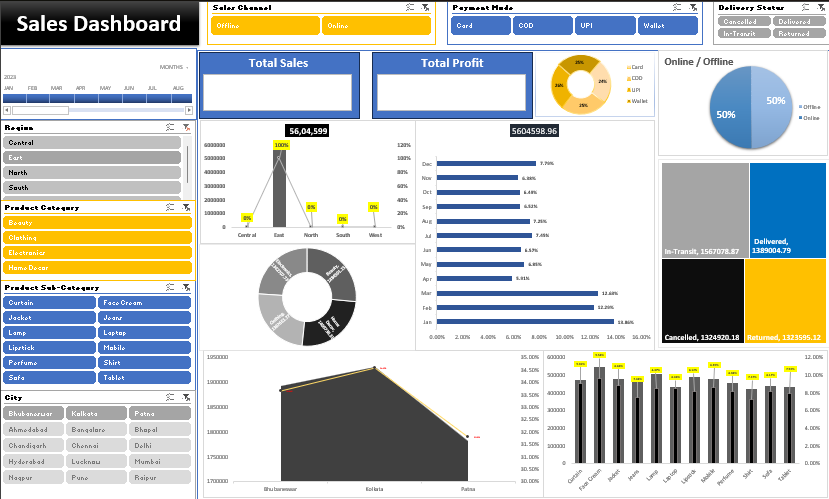

# 📈 Business KPI Dashboard (Excel)

An interactive **Business KPI Dashboard** built in **Microsoft Excel** to monitor, analyze, and visualize key business performance indicators (KPIs). This dashboard transforms raw business data into meaningful insights through dynamic charts, Pivot Tables, KPI cards, and interactive filters.

---

## 📌 Project Overview

This project demonstrates how Microsoft Excel can be used as a Business Intelligence tool to track organizational performance using interactive dashboards.

The dashboard consolidates key business metrics into a single view, enabling users to monitor trends, evaluate performance, and support data-driven decision-making.

---

## 🎯 Objectives

- Monitor key business performance indicators (KPIs).
- Analyze business performance through interactive dashboards.
- Track revenue and operational metrics.
- Identify business trends and performance gaps.
- Present complex data in a simple and visually engaging format.
- Support informed decision-making with data visualization.

---

## 🛠️ Tools & Technologies

- Microsoft Excel
- Pivot Tables
- Pivot Charts
- Slicers
- Conditional Formatting
- Excel Formulas
- KPI Cards
- Data Validation
- Interactive Dashboard Design

---

## 📊 Key Performance Indicators (KPIs)

- 📦 Total Orders
- 💰 Total Revenue
- 🚚 Delivered Orders
- 💵 Delivered Revenue
- 📈 Sales Performance
- 📉 Return Rate
- ❌ Cancelled Orders
- 🔄 RTO Performance
- 📊 Business Growth Metrics

---

## ✨ Dashboard Features

- Interactive KPI Cards
- Dynamic Charts & Graphs
- Slicer-Based Filtering
- Performance Summary
- Revenue Analysis
- Order Performance Tracking
- Business Trend Analysis
- Clean & Professional Dashboard Layout

---

## 📂 Project Structure

```text
BusinessKPIDashboard/
│── README.md
│── BusinessKPIDashboard.xlsx
│── Images/
│   └── Dashboard.png
```

---

## 📸 Dashboard Preview



---

## 🚀 Skills Demonstrated

- Data Analysis
- Dashboard Development
- Data Visualization
- Business Intelligence
- KPI Reporting
- Microsoft Excel
- Analytical Thinking
- Business Reporting

---

## 💡 Business Value

This dashboard enables businesses to:

- Monitor overall business performance.
- Track key operational KPIs.
- Identify trends and performance gaps.
- Evaluate revenue and order metrics.
- Support strategic business decisions.
- Improve reporting efficiency through interactive dashboards.

---

## 📷 Dashboard Highlights

The dashboard includes:

- 📊 KPI Summary Cards
- 📈 Interactive Charts
- 🎛️ Slicer-Based Filters
- 📋 Performance Metrics
- 📉 Trend Analysis
- 📌 Business Insights

---

## 📚 Learning Outcomes

Through this project, I gained hands-on experience in:

- Building interactive Excel dashboards
- Creating KPI-based reports
- Using Pivot Tables & Pivot Charts
- Applying Excel formulas for analysis
- Designing professional dashboards
- Presenting business insights visually

---

## 📌 Conclusion

The **Business KPI Dashboard** demonstrates the power of Microsoft Excel for Business Intelligence and performance reporting. It showcases practical skills in dashboard design, KPI reporting, data visualization, and business analysis, making it a valuable project for aspiring Data Analysts.

---

## 👩‍💻 Author

**Adheesh Kaushik**

Aspiring **Data Analyst** passionate about transforming data into actionable insights using **Excel, SQL, Power BI, Python, and Data Visualization**.

---

⭐ **If you found this project useful, consider giving it a Star!**
